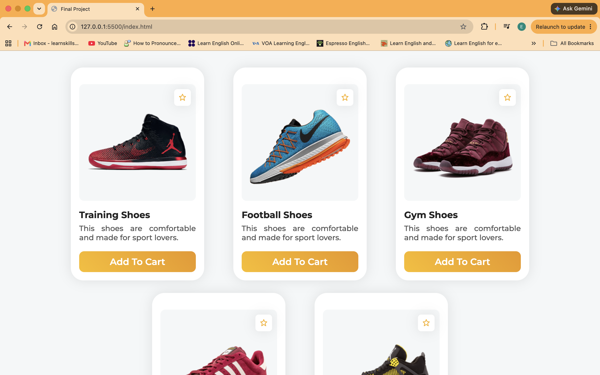

# 🚀 Product Card Using HTML - CSS 

**Final Project on git-GitHub Bootcamp for goobolabs**

A clean, modern, and fully responsive Product Card Component layout built using HTML and CSS. This UI displays sports shoes with interactive hover effects, star ratings, and "Add To Cart" buttons.

## 💡 Words to Live By

> *"Keep coding, keep learning, and never stop building."* 🚀

---

**Happy Coding!** 💻✨